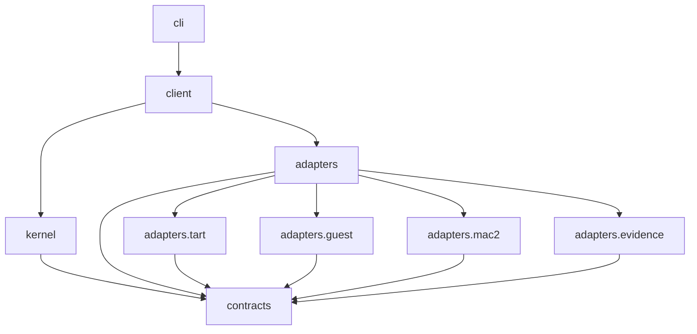
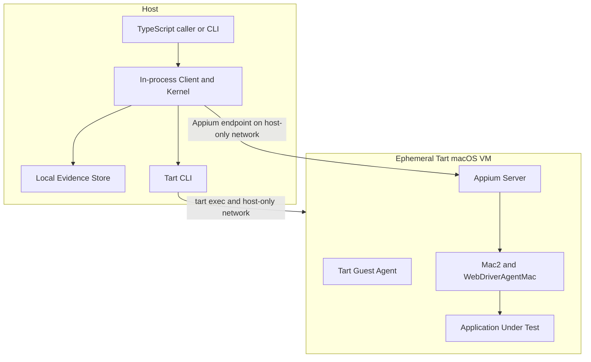

# macos-computer-use Project Specification

## Project Specification Ownership

This root specification owns repository-wide scope, architecture, module navigation, dependency direction, toolchain, deployment boundaries, supported platform baseline, and cross-module invariants. Each independently owned module has one `SPEC.md` that owns its current public contract and implementation boundary.

The repository workflow is defined by `AGENTS.md` and `.github/skills/`; workflow authorization is not a project behavior contract.

## Purpose And Scope

`macos-computer-use` is a local TypeScript runtime for evidence-backed desktop automation inside an ephemeral Tart macOS VM. A Host process allocates exactly one managed VM clone, establishes VM/Guest/Appium Mac2/AUT readiness, exposes an element-first Public Client API, captures mandatory Evidence, evaluates predeclared assertions, and always attempts finalization and cleanup.

The v1 runtime supports one Host user, one process-level Gateway operation, one active Run, one managed clone, and one serial lifecycle/observation/action/assertion operation at a time. Competing work fails fast; the runtime has no queue, warm pool, daemon, remote control plane, or concurrent scheduler.

The runtime does not build Golden Images, install software into a Run, provision TCC permissions, operate Host system UI, expose arbitrary Guest commands, or provide arbitrary `macos:*` passthrough. It is an isolation and cleanup boundary for trusted images and AUTs, not a strong sandbox for malicious Guest code.

## TypeScript And Build Contract

- Authored runtime code is TypeScript targeting Node.js 24 LTS.
- The repository is one pnpm package; `pnpm-lock.yaml` is dependency-resolution authority.
- The package uses native ESM and TypeScript `NodeNext` module resolution.
- `tsc` compiles `src/` to untracked `dist/`; no bundler owns runtime compilation.
- Type checking enables `strict`, `noUncheckedIndexedAccess`, and `exactOptionalPropertyTypes`.
- Zod schemas validate all untrusted and persisted inputs; public TypeScript types are inferred from their schemas.
- Vitest, ESLint, and Prettier own test execution, static checking, and formatting.
- CI runs typecheck, lint, test, and build. Provider and destructive tests run only on explicitly provisioned macOS workers.
- Public package exports are limited to the Public Client API and necessary Contracts. Kernel and Adapter implementation paths are private.

## Architecture Level

The project uses a Level 2 layered single-package architecture. Kernel policy depends on project-owned Contracts and Ports, never on Tart, Appium, Mac2, process, filesystem, or CLI types. Concrete Adapters depend inward on Contracts and implement Ports. Client owns the production composition root, and CLI calls Client rather than Kernel or Adapters.

## Module Table

| Module | SPEC | Ownership |
|---|---|---|
| contracts | `src/contracts/SPEC.md` | Runtime schemas, neutral types, IDs, public results, actions, assertions, Scenario, configuration, errors, and Ports |
| kernel | `src/kernel/SPEC.md` | Global serialization, Run/environment state, readiness, action transactions, assertion coordination, timeout/retry/cancel, recovery, and Hook policy |
| adapters | `src/adapters/SPEC.md` | Adapter-wide provider isolation, error normalization, capability and conformance rules |
| adapters.tart | `src/adapters/tart/SPEC.md` | OCI image, Tart VM, Host-only networking, and managed clone ownership |
| adapters.guest | `src/adapters/guest/SPEC.md` | `tart exec`, Guest probes, Appium lifecycle, and bounded Guest Artifact export |
| adapters.mac2 | `src/adapters/mac2/SPEC.md` | Mac2 session, canonical Observation, compact/structured views, element resolution, element-relative actions, and Provider Receipt |
| adapters.evidence | `src/adapters/evidence/SPEC.md` | Append-only timeline, content-addressed artifacts, Manifest revisions, local layout, integrity, and retention |
| client | `src/client/SPEC.md` | Public Client API, structured Run scope, production composition, and safe logical references |
| cli | `src/cli/SPEC.md` | Local commands, Scenario execution, human/JSON output, and exit categories |
| fixture AUT | `fixtures/macos-test-app/SPEC.md` | Deterministic native macOS application used by provider and destructive tests |

Implementation folders such as tests, examples, and small internal helpers do not acquire separate specifications unless they become independent ownership boundaries.

## Dependency Direction

- `contracts` imports no other project module.
- `kernel` imports only `contracts` and its public Ports.
- Concrete Adapter modules do not call each other; Kernel coordinates them through Ports.
- `client` is the only production composition root.
- `cli` does not import Kernel or concrete Adapter internals.
- Cross-module imports use public entry points, never another module's private files.

## Deployment Topology

Appium, Mac2, WebDriverAgentMac, and AUT run inside the Guest. `tart exec` manages probes, Appium process lifecycle, and bounded diagnostic export. The Guest uses Tart Host-only networking; bridged networking, public port forwarding, and shared clipboard are disabled.

## Supported Runtime Baseline

- Host: Apple Silicon macOS. The initial conformance host baseline includes macOS 26.6.2 arm64. Acceptance requires complete provider/destructive conformance on that version; no macOS 26.7 conformance is implied.
- Node.js: 24 LTS.
- Tart: 2.35.x, with 2.35.0 as the initial conformance version.
- Appium: major version 3, running in Guest.
- Mac2 Driver: 4.3.1.
- Guest macOS, Xcode, WDA Mac, Appium patch version, Fixture build, and permissions are fixed by an immutable Golden Image OCI digest plus validated image compatibility metadata. Host/runtime versions, the configured immutable digest, and Tart's exact-digest cache identity are validated before Run allocation. Guest, Appium, Mac2, WDA, desktop-session, AUT, and permission readiness are live-probed only on the fresh disposable clone, after allocation and before any business action.
- The final OCI digest is verified on the Host and is not embedded into the image itself. Guest metadata carries an independent build identity and compatibility information, validated against Host expectations bound to that OCI digest. The required `/etc/macos-computer-use/image-digest` file records this independent build identity, not the final OCI manifest digest; `/etc/macos-computer-use/fixture-metadata.json` records Fixture identity.

The composition root fails before Run allocation when Host-side requirements or the configured image digest are absent or outside the supported matrix. Clone-local live incompatibility fails before business work and proceeds directly to bounded Evidence finalization and cleanup. A version change that alters this baseline requires a confirmed SPEC update and provider/destructive conformance evidence.

For Tart 2.35.x, Host OCI integrity authority is the registry's immutable digest verification during pull plus Tart's exact `reference@sha256` cache identity. Tart does not expose cached image bytes or a cache-quarantine API to this runtime. The runtime therefore fails closed on missing, malformed, or inconsistent inventory/pull facts, never represents name-only evidence as an independent byte rehash, and never automatically deletes, mutates, or re-pulls an existing Golden Image cache. Stronger byte re-verification or quarantine becomes supported only when a provider exposes a verifiable byte/export API.

## Repository Boundaries

- `src/` contains authored TypeScript runtime source.
- `tests/` contains unit, semantic contract, provider conformance, and destructive integration tests.
- `examples/` contains public API and strict Scenario examples; examples do not own runtime semantics.
- `fixtures/macos-test-app/` is a separately built native macOS test application and is not part of the TypeScript package.
- `dist/`, dependency stores, generated test output, Run state, Evidence, and Fixture build products are generated or local data and are not authored source.

## Cross-Module Invariants

- A Provider success response never establishes business success. Only a predeclared independent assertion over a later Observation can produce `confirmed` or a passing Run verdict.
- Dispatch, Provider outcome, verification, retry disposition, Evidence completeness, cleanup status, and business verdict remain separate facts.
- No public or internal action contract accepts absolute display or window coordinates. Element-relative normalized points are converted only inside Mac2 Adapter and never fall back to absolute coordinates.
- Each window's latest canonical Observation is the only source of actionable ElementRefs. An Action invalidates ElementRefs for affected windows.
- Core Evidence is mandatory, write-ahead, append-only, and Kernel-coordinated. Hook failure cannot change business facts.
- Hooks execute in terminable Worker isolation from serializable module descriptors. The in-process runtime never invokes caller Hook functions. Timeout/cancellation terminates the Worker before cleanup continues; late Hook JavaScript, timers, handles, or repository authority cannot survive Worker termination.
- Required Evidence failure marks Evidence incomplete but never prevents bounded cleanup indefinitely. Cleanup failure never overwrites an established business verdict.
- Unknown dispatch or Provider outcome is never guessed and is never blindly retried.
- Golden Images are immutable; every formal Run uses a new managed clone and never modifies the shared image.
- The runtime never deletes a Tart VM without trustworthy project-owned Run attribution.
- Secret values are resolved in memory and excluded from configuration snapshots, structured UI snapshots, logs, events, receipts, errors, and other non-image artifacts. Window screenshots are an explicit exception: v1 captures and stores them normally, marks them potentiallySensitive, and does not mask or inspect visible secret text.
- Recovery finalizes Evidence and resources; it never resumes pre-crash business actions.

## Verification Obligations

Deterministic CI covers type checking, lint, formatting policy, unit tests, semantic Port contracts, package exports, and build. Provisioned macOS jobs cover real Tart/Mac2 provider conformance and destructive lifecycle. The destructive acceptance path uses a fixed image digest and Fixture AUT to exercise clone, readiness, compact/structured Observation, element-relative actions, independent assertions, Evidence finalization, and clone destruction. Missing required environment evidence is reported as skipped or blocking according to the invoked profile; it is never treated as passing.

## Host-only Network Rules

V1 NetworkRules constrain only destinations reachable inside the Host-only network. They do not provide Internet access or enable NAT, bridging, public forwarding, or Host-mediated egress. Nonempty rules preserve Tart Host-only mode and constrain Guest traffic by CIDR, port and protocol; the control channel and DHCP remain available. Effective filtering must be verified before business work. Rules never cause automatic network relaxation.
