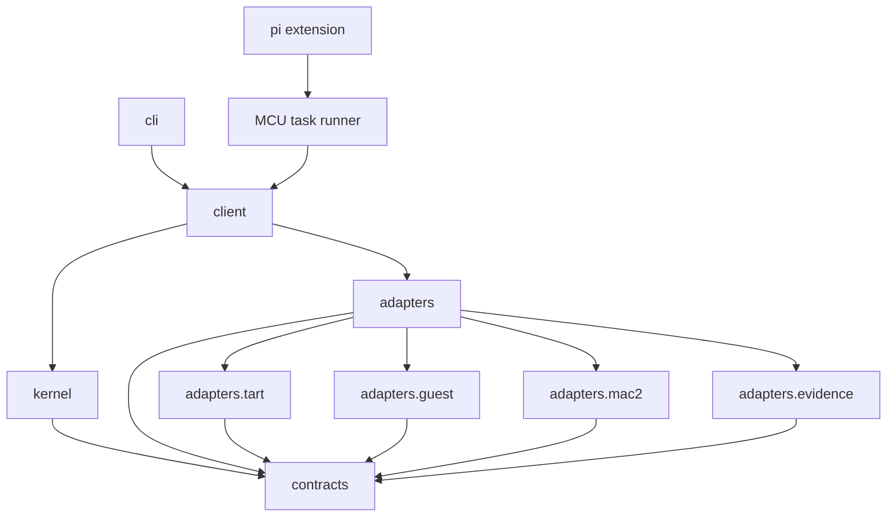
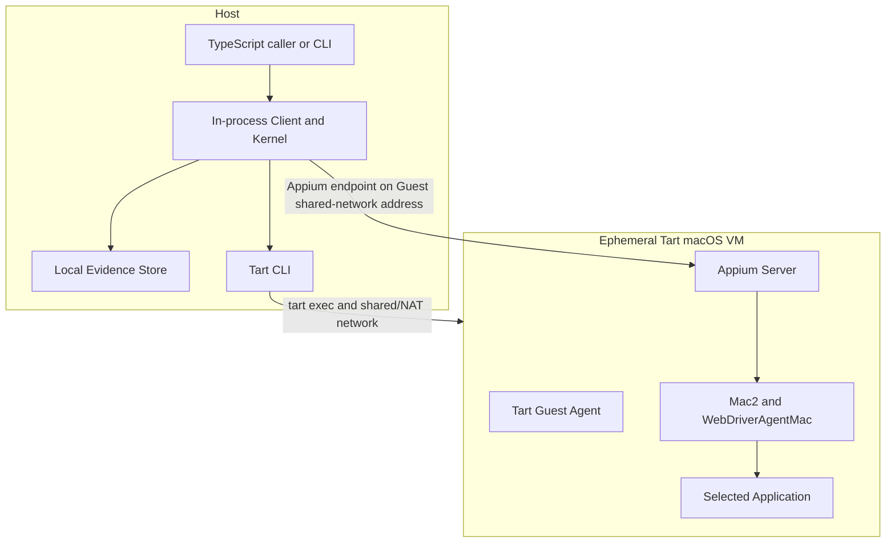

# macos-computer-use Project Specification

## Project Specification Ownership

This root specification owns repository-wide scope, architecture, module navigation, dependency direction, toolchain, deployment boundaries, supported platform baseline, and cross-module invariants. Each independently owned module has one `SPEC.md` that owns its current public contract and implementation boundary.

The repository workflow is defined by `AGENTS.md` and `.github/skills/`; workflow authorization is not a project behavior contract.

## Purpose And Scope

`macos-computer-use` is a local TypeScript runtime for evidence-backed desktop automation inside an ephemeral Tart macOS VM. A Host process allocates exactly one managed VM clone, establishes VM/Guest/Appium Mac2/application readiness, exposes an element-first Public Client API, captures mandatory Evidence, evaluates predeclared assertions, and always attempts finalization and cleanup. Configured Scenario/CLI Runs use the configured default AUT; Pi-managed Runs may instead resolve one user-confirmed installed GUI application by display name.

The v1 runtime supports one Host user, one process-level Gateway operation, one active Run, one managed clone, and one serial lifecycle/observation/action/assertion operation at a time. Competing work fails fast; the runtime has no queue, warm pool, daemon, remote control plane, or concurrent scheduler.

The runtime does not build Golden Images, install software into a Run, provision TCC permissions, operate Host system UI, expose arbitrary Guest commands, provide arbitrary `macos:*` passthrough, or select a decision-model provider. It is an isolation and cleanup boundary for trusted images and installed GUI applications, not a strong sandbox for malicious Guest code.

## TypeScript And Build Contract

- Authored runtime code is TypeScript targeting Node.js 24 LTS.
- The repository is one pnpm package; `pnpm-lock.yaml` is dependency-resolution authority.
- The package uses native ESM and TypeScript `NodeNext` module resolution.
- `tsc` compiles `src/` to untracked `dist/`; no bundler owns runtime compilation.
- Type checking enables `strict`, `noUncheckedIndexedAccess`, and `exactOptionalPropertyTypes`.
- Zod schemas validate all untrusted and persisted inputs; public TypeScript types are inferred from their schemas.
- Vitest, ESLint, and Prettier own test execution, static checking, and formatting.
- CI runs typecheck, lint, test, and build. Provider and destructive tests run only on explicitly provisioned macOS workers.
- Public package exports are limited to the Public Client API, necessary Contracts, and the local Pi Extension entry point. Kernel, Adapter, Pi runner, and Pi protocol implementation paths are private.

## Architecture Level

The project uses a Level 2 layered single-package architecture. Kernel policy depends on project-owned Contracts and Ports, never on Tart, Appium, Mac2, process, filesystem, or CLI types. Concrete Adapters depend inward on Contracts and implement Ports. Client owns the production composition root, and CLI calls Client rather than Kernel or Adapters.

## Module Table

| Module            | SPEC                              | Ownership                                                                                                                                            |
| ----------------- | --------------------------------- | ---------------------------------------------------------------------------------------------------------------------------------------------------- |
| contracts         | `src/contracts/SPEC.md`           | Runtime schemas, neutral types, IDs, public results, actions, assertions, Scenario, configuration, errors, and Ports                                 |
| kernel            | `src/kernel/SPEC.md`              | Global serialization, Run/environment state, readiness, action transactions, assertion coordination, timeout/retry/cancel, recovery, and Hook policy |
| adapters          | `src/adapters/SPEC.md`            | Adapter-wide provider isolation, error normalization, capability and conformance rules                                                               |
| adapters.tart     | `src/adapters/tart/SPEC.md`       | OCI image, Tart VM, shared-network clone lifecycle, and managed clone ownership                                                                       |
| adapters.guest    | `src/adapters/guest/SPEC.md`      | `tart exec`, Guest probes, Appium lifecycle, and bounded Guest Artifact export                                                                       |
| adapters.mac2     | `src/adapters/mac2/SPEC.md`       | Mac2 session, canonical Observation, compact/structured views, element resolution, element-relative actions, and Provider Receipt                    |
| adapters.evidence | `src/adapters/evidence/SPEC.md`   | Append-only timeline, content-addressed artifacts, Manifest revisions, local layout, integrity, and retention                                        |
| client            | `src/client/SPEC.md`              | Public Client API, structured Run scope, production composition, and safe logical references                                                         |
| cli               | `src/cli/SPEC.md`                 | Local commands, Scenario execution, human/JSON output, and exit categories                                                                           |
| pi extension      | `src/pi-extension/SPEC.md`        | Pi TUI tools, task-scoped Run supervision, confirmation, IPC lease, and forced cleanup                                                               |
| fixture AUT       | `fixtures/macos-test-app/SPEC.md` | Deterministic native macOS application used by provider and destructive tests                                                                        |

Implementation folders such as tests, examples, and small internal helpers do not acquire separate specifications unless they become independent ownership boundaries.

## Dependency Direction

- `contracts` imports no other project module.
- `kernel` imports only `contracts` and its public Ports.
- Concrete Adapter modules do not call each other; Kernel coordinates them through Ports.
- `client` is the only production composition root.
- `cli` does not import Kernel or concrete Adapter internals.
- `pi-extension` depends only on the Public Client API and public Contracts; its supervised runner and protocol remain private implementation paths.
- Cross-module imports use public entry points, never another module's private files.

## Deployment Topology

Appium, Mac2, WebDriverAgentMac, and the selected application run inside the Guest. `tart exec` manages probes, installed-application resolution, Appium process lifecycle, and bounded diagnostic export. The Guest uses Tart shared/NAT networking with unrestricted outbound Internet access for this early-stage profile. Bridged networking, inbound/public port forwarding, and shared clipboard remain disabled.

## Supported Runtime Baseline

- Host: Apple Silicon macOS. The initial conformance host baseline includes macOS 26.6.2 arm64. Acceptance requires complete provider/destructive conformance on that version; no macOS 26.7 conformance is implied.
- Node.js: 24 LTS.
- Tart: 2.35.x, with 2.35.0 as the initial conformance version.
- Appium: 3.7.0, running in Guest.
- Mac2 Driver: 4.3.5.
- Guest macOS, Xcode, WDA Mac, Appium 3.7.0, Mac2 4.3.5, Fixture build, and permissions are fixed by one newly published immutable Golden Image and matching compatibility metadata. The new Golden Image build identity, OCI digest, and WDA source SHA-256 replace the prior 4.3.1 image authority together; mixing old and new identity fields fails before business work.
- The final OCI digest is verified on the Host and is not embedded into the image itself. Existing Guest build and Fixture metadata contracts remain unchanged in this increment.

The composition root fails before Run allocation when Host-side requirements or the configured image digest are absent or outside the supported matrix. Clone-local live incompatibility fails before business work and proceeds directly to bounded Evidence finalization and cleanup. A version change that alters this baseline requires a confirmed SPEC update and provider/destructive conformance evidence.

For Tart 2.35.x, Host OCI integrity authority is the registry's immutable digest verification during pull plus Tart's exact `reference@sha256` cache identity. Tart does not expose cached image bytes or a cache-quarantine API to this runtime. The runtime therefore fails closed on missing, malformed, or inconsistent inventory/pull facts, never represents name-only evidence as an independent byte rehash, and never automatically deletes, mutates, or re-pulls an existing Golden Image cache. Stronger byte re-verification or quarantine becomes supported only when a provider exposes a verifiable byte/export API.

## Repository Boundaries

- `src/` contains authored TypeScript runtime source.
- `tests/` contains unit, semantic contract, provider conformance, and destructive integration tests.
- `examples/` contains public API and strict Scenario examples; examples do not own runtime semantics.
- `fixtures/macos-test-app/` is a separately built native macOS test application and is not part of the TypeScript package.
- `dist/`, dependency stores, generated test output, Run state, Evidence, and Fixture build products are generated or local data and are not authored source.

## Cross-Module Invariants

- A Provider success response never establishes business success. Only a predeclared independent assertion over a later Observation can produce `confirmed` or a passing Run verdict.
- Dispatch, Provider outcome, verification, retry disposition, Evidence completeness, cleanup status, and business verdict remain separate facts.
- No public or internal action contract accepts absolute display or window coordinates. Element-relative normalized points are converted only inside Mac2 Adapter and never fall back to absolute coordinates.
- Each window's latest canonical Observation is the only source of actionable ElementRefs. An Action invalidates ElementRefs for affected windows.
- Core Evidence is mandatory, write-ahead, append-only, and Kernel-coordinated. Hook failure cannot change business facts.
- Hooks execute in terminable Worker isolation from serializable module descriptors. The in-process runtime never invokes caller Hook functions. Timeout/cancellation terminates the Worker before cleanup continues; late Hook JavaScript, timers, handles, or repository authority cannot survive Worker termination.
- Required Evidence failure marks Evidence incomplete but never prevents bounded cleanup indefinitely. Cleanup failure never overwrites an established business verdict.
- Unknown dispatch or Provider outcome is never guessed and is never blindly retried.
- Golden Images are immutable; every formal Run uses a new managed clone and never modifies the shared image.
- The runtime never deletes a Tart VM without trustworthy project-owned Run attribution.
- Secret values are resolved in memory and excluded from configuration snapshots, structured UI snapshots, logs, events, receipts, errors, and other non-image artifacts. Guest display screenshots are an explicit exception: v1 captures and stores them normally, marks them potentiallySensitive, and does not mask or inspect visible secret text.
- Recovery finalizes Evidence and resources; it never resumes pre-crash business actions.
- A Pi-managed automation task is fail-dead: Pi process exit, Extension unload/failure, IPC loss, or task-runner lease expiry immediately revokes dispatch authority and requests Run cancellation. No further automation action may start after supervision is lost. The runner then performs ordinary bounded finalization and cleanup; a runner process crash is reconciled by ownership recovery on the next startup.
- A Pi-managed Run resolves one exact installed GUI application bundle name from fixed standard Guest application roots to one immutable ApplicationDescriptor before creating a Mac2 session. The resolved identity is frozen for that Run; focus loss, another application, or protected system UI stops dispatch and is never silently accepted or switched. Configured Scenario/CLI Runs retain the existing configured AUT path.
- Initial VM, Guest, Driver, and application readiness remains mandatory for every Run. For a Pi-managed Run, those initial probe freshness windows are startup evidence rather than a human-interaction deadline: after activation, business operations remain authorized until the Run lease or total deadline while each real Desktop operation still checks the live session, frozen application, owned window, and foreground state and fails closed. Configured Scenario/CLI readiness-expiry behavior remains unchanged.
- Every Pi, Public Client, CLI, and Scenario Run has one fixed 7,200,000 ms total budget. Cleanup retains its independent fixed 120,000 ms budget and cannot extend business execution. Every Mac2 Session is created with a fixed 3,000-second Appium new-command idle timeout; this provider timeout is subordinate to the Kernel Run deadline and is reset by each Appium command. Pi heartbeat cadence and lease remain unchanged.
- Kernel rejects the fixed protected-application bundle-ID denylist for Pi-selected applications before session creation. Pi and Agent input cannot supply a bundle ID, application path, or policy override.
- Pi owns natural-language planning. MCU exposes neutral Observation, query, and bounded action contracts but does not invoke a candidate-ranking or decision model and never accepts a decision model as execution authority.
- Text mutation is keyboard-only. The action contract exposes one targetless `typeText` operation. For every application and control type, including native controls and WebView content, the Adapter sends the requested literal or resolved SecretRef text only through ordered application-scoped Mac2 `macos: keys` calls containing exactly one Unicode code point each. It never queries `GET /element/active`, supplies an `elementId`, selects a provider path by application/control type, or captures Observation between characters. Text is delivered to whichever control the application currently considers focused, so callers establish focus with a separate click. `typeText` does not clear, select, append, replace, focus, or submit implicitly and rejects newline, return, and control characters. Once any character has been dispatched, a later character failure stops immediately, never replays prior characters, and returns dispatched/unknown outcome requiring reconciliation. `appendText` and `replaceText` do not exist. WebDriver element-value endpoints are read-only and are never called with POST/PUT/PATCH. Clearing, replacing, caret movement, and submission are explicit compositions of a prior click plus separate `pressKey` actions such as Command+A, Backspace, End, and Enter. `pressKey` accepts either one supported special key or one printable Unicode character with neutral modifiers, uses the same application-scoped `macos: keys` mechanism, and accepts no target.
- After any successfully dispatched action, including `typeText`, text-field click, and key input, Kernel waits the configured Observation backoff before capturing the after-Observation. It may retry only that Observation under the existing bounded Observation retry policy and remaining Observation/Run budgets. The action is never replayed. If all after-Observation attempts fail, the result preserves the successful Provider dispatch/outcome and the last safe normalized Observation error, remains unverifiable, and terminates Pi authority.
- Observation captures images only through the provider-owned Mac2 `macos: screenshots` extension and accepts exactly one `isMain=true` display payload after page source, foreground application, and unique target-window ownership have been freshly verified. It never calls a window-element or generic WebDriver session screenshot endpoint. The command is read-only, never changes focus or UI state, remains potentiallySensitive Evidence, and is labeled `display`; it may contain other UI visible on the Guest display and is never represented as window-cropped. Zero or multiple main-display results, malformed payloads, or provider failure remain Observation failures under the same retry budget. No public screenshot tool, Host screenshot API, or additional screenshot provider is introduced.
- Observation normally reads standard Mac2/WDA `/source`. If that provider endpoint fails, the Adapter invokes exactly one Mac2-owned `macos: source` request with `format=xml`. The fallback remains read-only and must pass the same XML byte, depth, node, selected-window ownership, foreground-application, and sanitization checks. It never changes focus or replays the action. Failure of both source paths produces one normalized Observation error under the existing retry budget.
- Initial readiness always requires a screenshot. After readiness, if canonical page source, foreground/ownership validation, and structured snapshot parsing succeed but the Mac2 display screenshot fails, Kernel may commit a structured-only Observation with `screenshotScope=unavailable` for action-before or action-after use. Evidence is marked incomplete and the earliest safe normalized Provider cause from the Observation attempt/retry chain is retained; later failures caused by the same Provider degradation cannot replace it. A Mac2/WDA process-unavailable response is classified as `SessionUnavailable`, not generic `ProviderFailure`. A structured-only before Observation may authorize only a nonvisual action whose target is uniquely live-rebound and whose nonvisual preconditions pass; any `aiVisual` precondition blocks dispatch as unverifiable. A structured-only after Observation may evaluate deterministic nonvisual assertions; `aiVisual` is unverifiable. The action is never reclassified or replayed solely because image capture is unavailable.
- After a terminal `macos_*` failure, the same Pi agent turn cannot create another Run. A later user turn may explicitly begin a new task after cleanup.
- Pi action planning is constrained by Extension-owned task state. `pressKey` and `typeText` accept neither a target nor immediate assertions. Action targets must resolve uniquely against the latest canonical Observation and Pi may use only locator fields actually shown by the latest compact/expanded result or returned by a successful query. A correctable target failure opens a recovery gate that permits read-only observe/query refinement but no further action until one succeeds. After each successful action or explicit assertion, the Extension internally evaluates the frozen final assertions through the supervised runner; when all pass, the task becomes completion-ready and model-callable work is limited to finish or abort, while the operator-only status command remains available. A `typeText` action cannot establish completion-ready solely from final assertions that match the focused input's newly typed value; a later explicit assertion or subsequent action must establish completion. Terminal failure blocks every later model-callable macOS tool in that agent turn.
- Pi confirms before allocating the Tart Run and before a user-requested normal finish. Actions execute without confirmation by default. When the user explicitly requires confirmation for a particular action, Pi marks that `macos_action` for one Extension-owned confirmation dialog; Pi never adds a separate natural-language confirmation. Abort, terminal failure, cancellation, supervision loss, and process exit clean up without confirmation.
- Every Run uses `networkMode: shared` with outbound Internet access enabled. V1 exposes no network allowlist or per-Run network override. Remote pages and responses are untrusted input and cannot grant tool authority, change the frozen application, bypass Pi confirmation, or establish test success.

## Verification Obligations

Deterministic CI covers type checking, lint, formatting policy, unit tests, semantic Port contracts, package exports, and build. Provisioned macOS jobs cover real Tart/Mac2 provider conformance and destructive lifecycle. Existing Scenario/CLI acceptance remains unchanged except for the fixed two-hour Run budget. Pi acceptance additionally resolves the Fixture by display name, completes verified actions across an interaction interval longer than the initial application-readiness window, returns compact post-action state, observes one allowed non-Fixture GUI application, proves a terminal tool failure performs bounded abort/cleanup without a model-issued abort or same-turn Run restart, and proves protected-application selection fails before session creation. Deterministic Pi tests cover rejection of target/assertion-bearing `pressKey`/`typeText`, removal of append/replace contracts and every element-value write path, guessed/unresolved locator fields, action suppression during correctable-target recovery, completion-ready suppression of exploratory/query/double-click work, and fail-dead suppression of every later tool call. The Mac2 4.3.5 Golden Image acceptance chain must prove exact compatibility metadata and WDA hash, complete Fixture keyboard/checkbox behavior, the Safari TodoMVC Extension flow, continued Session use after more than 60 seconds idle, complete Evidence, completed cleanup, and no residual managed clone. No skipped or partial provider run satisfies this image-baseline acceptance.

## Network Profile

For the early-stage profile, GatewayConfig must carry `network: []`. Empty rules start Tart with shared/NAT outbound Internet access, shared clipboard disabled, and no public/inbound forwarding. Nonempty NetworkRules are rejected as unsupported. Removing the legacy field and redesigning network Evidence are deferred.
